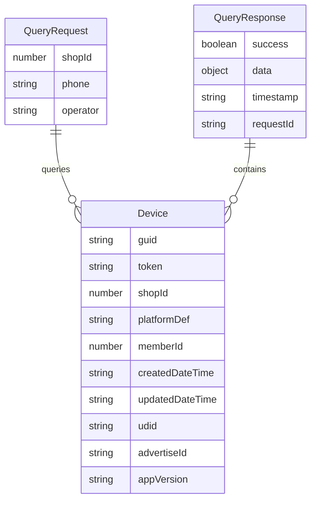
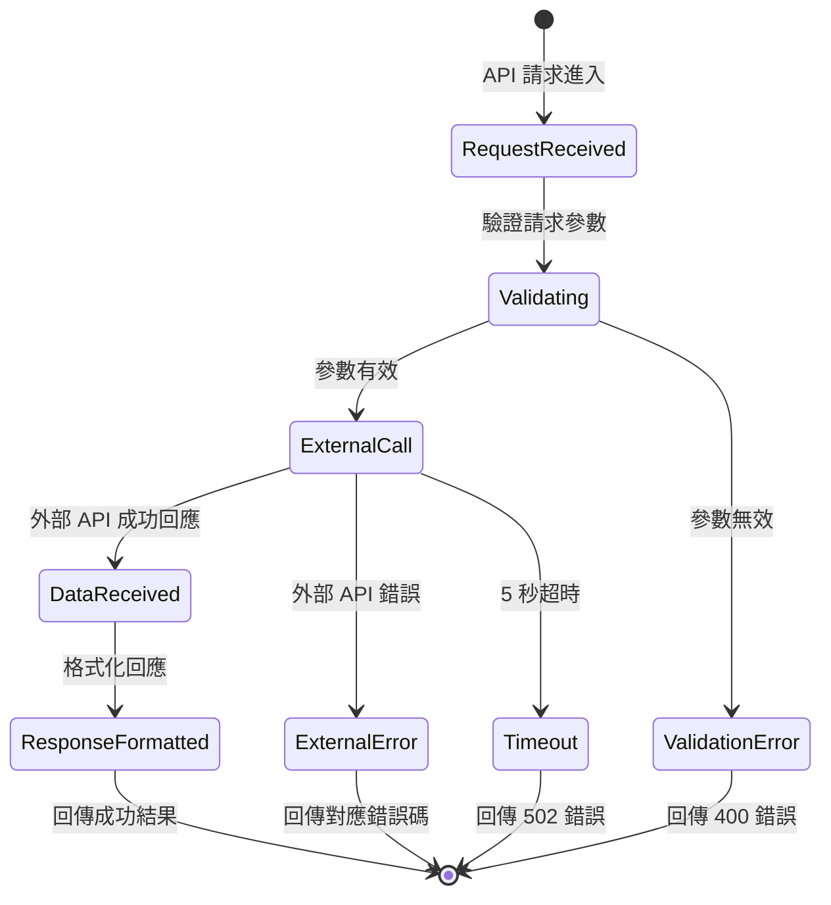

# Data Model: Marketing Cloud 裝置 API 整合

## 實體定義

### Device Entity
代表在 Marketing Cloud 中註冊的行動裝置資訊。

```typescript
interface Device {
  // 必需欄位
  guid: string;           // 裝置唯一識別碼 (UUID 格式)
  token: string;          // 推播 Token
  shopId: number;         // 商店 ID
  platformDef: string;    // 平台定義 ("iOS" | "Android")
  memberId: number;       // 會員 ID
  createdDateTime: string; // 建立時間 (ISO 8601)
  updatedDateTime: string; // 更新時間 (ISO 8601)

  // 可選欄位
  udid?: string;          // 裝置 UDID
  advertiseId?: string;   // 廣告追蹤 ID
  appVersion?: string;    // App 版本
}
```

**驗證規則**:
- `guid`: 必需，UUID 格式
- `token`: 必需，非空字串
- `shopId`: 必需，正整數
- `platformDef`: 必需，限制值 "iOS" 或 "Android"
- `memberId`: 必需，正整數
- `createdDateTime`: 必需，ISO 8601 格式
- `updatedDateTime`: 必需，ISO 8601 格式

### QueryRequest Entity
代表 API 查詢請求的參數。

```typescript
interface QueryRequest {
  shopId: number;    // 商店 ID (路徑參數)
  phone: string;     // 會員手機號碼 (路徑參數)
  operator: string;  // 操作者識別 (Header: ny-operator)
}
```

**驗證規則**:
- `shopId`: 必需，正整數
- `phone`: 必需，非空字串 (不進行格式驗證)
- `operator`: 必需，非空字串 (Header 驗證)

### QueryResponse Entity
代表 API 查詢回應的結構。

```typescript
interface QueryResponse {
  success: true;
  data: {
    shopId: number;
    phone: string;
    devices: Device[];
    totalCount: number;
  };
  timestamp: string;   // 回應時間戳記
  requestId: string;   // 請求追蹤 ID
}
```

**資料規則**:
- `data.devices`: Device 實體陣列
- `data.totalCount`: devices 陣列長度
- `timestamp`: ISO 8601 格式的回應時間
- `requestId`: 唯一請求識別碼

## 實體關係



**關係說明**:
- 一個 `QueryRequest` 可查詢到多個 `Device` 記錄
- `Device` 透過 `shopId` 和 `memberId` 與查詢請求關聯
- `QueryResponse` 包含查詢到的所有 `Device` 實體

## 狀態轉換

### 查詢流程狀態


## DTO (資料傳輸物件) 定義

### GetMemberDevicesQueryDto
```typescript
export class GetMemberDevicesQueryDto {
  @ApiProperty({ description: '商店 ID', example: 12345 })
  @IsNumber()
  @IsPositive()
  shopId: number;

  @ApiProperty({ description: '會員手機號碼', example: '0912345678' })
  @IsString()
  @IsNotEmpty()
  phone: string;
}
```

### MemberDevicesResponseDto
```typescript
export class MemberDevicesResponseDto {
  @ApiProperty({ description: '請求是否成功', example: true })
  success: true;

  @ApiProperty({
    description: '查詢結果資料',
    type: 'object',
    properties: {
      shopId: { type: 'number', example: 12345 },
      phone: { type: 'string', example: '0912345678' },
      devices: { type: 'array', items: { $ref: '#/components/schemas/Device' } },
      totalCount: { type: 'number', example: 1 }
    }
  })
  data: {
    shopId: number;
    phone: string;
    devices: Device[];
    totalCount: number;
  };

  @ApiProperty({ description: '回應時間戳記', example: '2025-09-27T10:45:00.000Z' })
  timestamp: string;

  @ApiProperty({ description: '請求追蹤 ID', example: 'req-20250927104500-uuid' })
  requestId: string;
}
```

### DeviceDto
```typescript
export class DeviceDto {
  @ApiProperty({ description: '裝置唯一識別碼', example: '550e8400-e29b-41d4-a716-446655440000' })
  guid: string;

  @ApiProperty({ description: '裝置 UDID', example: 'A1B2C3D4E5F6', required: false })
  udid?: string;

  @ApiProperty({ description: '推播 Token', example: 'abc123def456...' })
  token: string;

  @ApiProperty({ description: '商店 ID', example: 12345 })
  shopId: number;

  @ApiProperty({ description: '平台定義', example: 'iOS' })
  platformDef: string;

  @ApiProperty({ description: '會員 ID', example: 67890 })
  memberId: number;

  @ApiProperty({ description: '廣告追蹤 ID', example: '12345678-1234-5678-9012-123456789012', required: false })
  advertiseId?: string;

  @ApiProperty({ description: 'App 版本', example: '1.2.3', required: false })
  appVersion?: string;

  @ApiProperty({ description: '更新時間', example: '2025-09-27T10:30:00.000Z' })
  updatedDateTime: string;

  @ApiProperty({ description: '建立時間', example: '2025-09-01T08:15:00.000Z' })
  createdDateTime: string;
}
```

## 資料流向

```
用戶請求 → QueryRequest → 外部 API 呼叫 → Device[] → QueryResponse → 用戶回應
```

**詳細流程**:
1. 用戶發送 GET 請求，包含 `shopId` 和 `phone` 路徑參數
2. 系統封裝為 `QueryRequest` 實體
3. 透過 HTTP Client 呼叫外部 Marketing Cloud API
4. 外部 API 回傳 `Device[]` 陣列資料
5. 系統包裝為標準 `QueryResponse` 格式
6. 回傳給用戶端

## 錯誤處理資料模型

### ApiErrorResponse
```typescript
interface ApiErrorResponse {
  success: false;
  error: {
    code: string;        // 錯誤代碼
    message: string;     // 錯誤訊息
    details?: any;       // 錯誤詳細資訊
  };
  timestamp: string;     // 錯誤時間戳記
  requestId: string;     // 請求追蹤 ID
}
```

**錯誤代碼對應**:
- `EXTERNAL_SERVICE_UNAVAILABLE`: 外部服務無法存取 (502)
- `MEMBER_NOT_FOUND`: 會員或裝置不存在 (404)
- `INVALID_REQUEST`: 請求參數無效 (400)
- `UNAUTHORIZED`: 缺少操作者識別 (401)