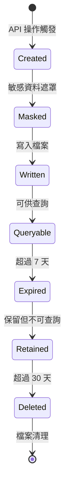

# 稽核日誌資料模型

**版本**: 1.0  
**日期**: 2025-10-06  

## 核心實體

### AuditLogData (稽核日誌資料)

**描述**: 代表單一稽核日誌記錄，包含完整的操作上下文和追蹤資訊。

**欄位定義**:

| 欄位名稱 | 型別 | 必填 | 描述 | 範例值 |
|---------|------|------|------|--------|
| `id` | string | ✓ | 唯一識別碼 (UUID v4) | `"f47ac10b-58cc-4372-a567-0e02b2c3d479"` |
| `timestamp` | string | ✓ | 操作時間戳記 (ISO 8601) | `"2025-10-06T14:30:52.123Z"` |
| `operator` | string | ✓ | 操作者識別 (ny-operator header) | `"admin@91app.com"` |
| `method` | string | ✓ | HTTP 方法 | `"POST"`, `"PUT"`, `"PATCH"`, `"DELETE"` |
| `path` | string | ✓ | API 路徑 | `"/api/v1/shops/12345/suppliers"` |
| `queryParams` | object | ✗ | 查詢參數 (URL parameters) | `{"limit": 10, "offset": 0}` |
| `requestBody` | object | ✗ | 請求主體 (已遮罩敏感資料) | `{"name": "supplier", "token": "***"}` |
| `statusCode` | number | ✓ | HTTP 回應狀態碼 | `200`, `404`, `500` |
| `ipAddress` | string | ✗ | 客戶端 IP 位址 | `"192.168.1.100"` |
| `userAgent` | string | ✗ | 使用者代理字串 | `"Mozilla/5.0..."` |
| `requestId` | string | ✓ | 關聯的請求 ID | `"req-20251006143052-abc123"` |

**驗證規則**:
- `id`: 必須為有效的 UUID v4 格式
- `timestamp`: 必須為有效的 ISO 8601 格式
- `operator`: 不可為空字串，長度 ≤ 255 字元
- `method`: 必須為 POST, PUT, PATCH, DELETE 其中之一
- `path`: 必須以 `/api/v1/shops/` 或 `/api/v1/notification-status/` 開頭
- `statusCode`: 必須為 100-599 範圍的整數
- `requestId`: 必須符合 Request ID 格式規範

**索引設計** (未來資料庫遷移用):
- Primary Key: `id`
- Index: `timestamp DESC` (查詢效能)
- Index: `operator` (操作者過濾)
- Index: `path` (路徑過濾)
- Index: `requestId` (關聯查詢)

### AuditLogQueryCriteria (查詢條件)

**描述**: 稽核日誌查詢 API 的輸入參數。

**欄位定義**:

| 欄位名稱 | 型別 | 必填 | 描述 | 預設值 | 驗證規則 |
|---------|------|------|------|--------|----------|
| `operatorFilter` | string | ✗ | 操作者過濾 | - | 長度 ≤ 255 |
| `pathFilter` | string | ✗ | API 路徑關鍵字過濾 | - | 長度 ≤ 500 |
| `pageFilter` | string | ✗ | 業務頁面過濾 | - | 長度 ≤ 100 |
| `action` | string | ✗ | 業務動作過濾 | - | 業務動作名稱 |
| `method` | string | ✗ | HTTP 方法過濾 | - | POST\|PUT\|PATCH\|DELETE |
| `statusCode` | number | ✗ | HTTP 狀態碼過濾 | - | 100-599 |
| `startDate` | string | ✗ | 查詢起始時間 | 7天前 | ISO 8601, ≤ 7天前 |
| `endDate` | string | ✗ | 查詢結束時間 | 現在 | ISO 8601, ≥ startDate |
| `limit` | number | ✗ | 每頁筆數 | 50 | 1-100 |
| `offset` | number | ✗ | 分頁偏移量 | 0 | ≥ 0 |

### AuditLogResult (查詢結果)

**描述**: 查詢 API 的回應資料結構。

**結構定義**:
```typescript
interface AuditLogResult {
  success: true;
  data: AuditLogEntry[];
  pagination: {
    total: number;      // 符合條件的總筆數
    limit: number;      // 每頁筆數
    offset: number;     // 當前偏移量
  };
  timestamp: string;    // 回應時間戳記
  requestId: string;    // 請求追蹤 ID
}
```

### AuditLogEntry (查詢回應項目)

**描述**: 查詢結果中的單一稽核日誌項目，結構化呈現便於前端使用。

**欄位定義**:

| 欄位名稱 | 型別 | 描述 | 範例值 |
|---------|------|------|--------|
| `id` | string | 唯一識別碼 | `"f47ac10b-58cc-4372-a567-0e02b2c3d479"` |
| `operator` | string | 操作者 | `"admin@91app.com"` |
| `page` | string | 頁面識別 | `"supplier-management"` |
| `action` | string | 動作描述 | `"update-supplier"` |
| `fields` | object | 操作相關欄位 | `{"shopId": 12345, "oldSupplierId": 100}` |
| `metadata` | object | 技術元資料 | `{"method": "PATCH", "path": "/api/v1/shops/12345/suppliers", "statusCode": 200}` |
| `ipAddress` | string | IP 位址 | `"192.168.1.100"` |
| `userAgent` | string | 使用者代理 | `"Mozilla/5.0..."` |
| `createdAt` | string | 建立時間 | `"2025-10-06T14:30:52.123Z"` |
| `requestId` | string | 請求 ID | `"req-20251006143052-abc123"` |

## 資料轉換邏輯

### 儲存時轉換 (AuditLogData → JSON Lines)

1. **敏感資料遮罩**: 遞迴掃描 `requestBody` 和 `queryParams`
2. **時間格式化**: 確保 `timestamp` 為 UTC ISO 8601 格式
3. **欄位驗證**: 檢查所有必填欄位和格式
4. **序列化**: 轉換為單行 JSON 字串並寫入檔案

### 查詢時轉換 (JSON Lines → AuditLogEntry)

1. **檔案讀取**: 讀取指定日期範圍的 `.jsonl` 檔案
2. **反序列化**: 每行解析為 `AuditLogData` 物件
3. **過濾**: 根據查詢條件過濾記錄
4. **轉換**: 轉換為 `AuditLogEntry` 結構
5. **分頁**: 應用 limit/offset 分頁邏輯

### 資料遮罩規則

**敏感欄位模式** (不區分大小寫):
- `password`, `passwd`, `pwd`
- `token`, `accessToken`, `refreshToken`
- `secret`, `clientSecret`, `apiSecret`
- `key`, `apiKey`, `privateKey`
- `auth`, `authorization`

**遮罩邏輯**:
```typescript
function maskSensitiveData(data: any): any {
  if (typeof data === 'object' && data !== null) {
    if (Array.isArray(data)) {
      return data.map(maskSensitiveData);
    }
    
    const masked = {};
    for (const [key, value] of Object.entries(data)) {
      if (SENSITIVE_PATTERNS.some(pattern => pattern.test(key))) {
        masked[key] = '***';
      } else {
        masked[key] = maskSensitiveData(value);
      }
    }
    return masked;
  }
  return data;
}
```

## 檔案格式規範

### JSON Lines 格式
- 檔案名稱: `audit-YYYYMMDD.jsonl`
- 每行一個完整的 JSON 物件
- UTF-8 編碼
- Unix 換行符 (\n)

### 範例檔案內容
```jsonl
{"id":"f47ac10b-58cc-4372-a567-0e02b2c3d479","timestamp":"2025-10-06T14:30:52.123Z","operator":"admin@91app.com","method":"POST","path":"/api/v1/shops/12345/suppliers","requestBody":{"name":"supplier","token":"***"},"statusCode":201,"ipAddress":"192.168.1.100","userAgent":"Mozilla/5.0...","requestId":"req-20251006143052-abc123"}
{"id":"a8b2c4d6-dd70-4edd-9f86-a2cfc0e8be22","timestamp":"2025-10-06T14:35:15.456Z","operator":"user@91app.com","method":"DELETE","path":"/api/v1/notification-status/devices/999","statusCode":404,"ipAddress":"192.168.1.101","userAgent":"PostmanRuntime/7.28.0","requestId":"req-20251006143515-def456"}
```

## 狀態轉換

### 稽核日誌生命週期



### 狀態說明

1. **Created**: 攔截器捕獲 API 操作，建立稽核記錄
2. **Masked**: 敏感資料遮罩處理完成
3. **Written**: 成功寫入檔案系統
4. **Queryable**: 可透過查詢 API 存取 (≤ 7 天)
5. **Expired**: 超過查詢範圍但仍保留檔案
6. **Retained**: 超過查詢期限但未達清理條件
7. **Deleted**: 檔案被自動清理機制移除

## 效能考量

### 寫入效能
- **預期負載**: ≤ 1 操作/秒
- **檔案大小**: ~100-200KB/天
- **I/O 模式**: 同步 append 寫入
- **瓶頸**: 檔案系統 I/O 延遲 (~1-5ms)

### 查詢效能
- **資料量**: 7 天 ≤ 600 筆記錄
- **檔案數**: 最多 7 個檔案
- **記憶體使用**: ~1-2MB (載入全部記錄)
- **回應時間**: 預期 <100ms

### 儲存效能
- **單筆大小**: ~1-2KB
- **日保留**: ~200KB
- **30天保留**: ~6MB
- **清理頻率**: 每日自動檢查

## 未來擴展設計

### 資料庫遷移準備
- 欄位設計已考慮 SQL 相容性
- 索引策略預先規劃
- 抽象介面支援實作替換

### 功能擴展支援
- 預留 `metadata` 欄位供擴展使用
- 結構化的 `fields` 欄位便於分析
- 標準化的時間和 ID 格式便於整合

### 整合支援
- 相容現有的 Request ID 機制
- 符合專案錯誤處理標準
- 支援國際化 (i18n) 擴展